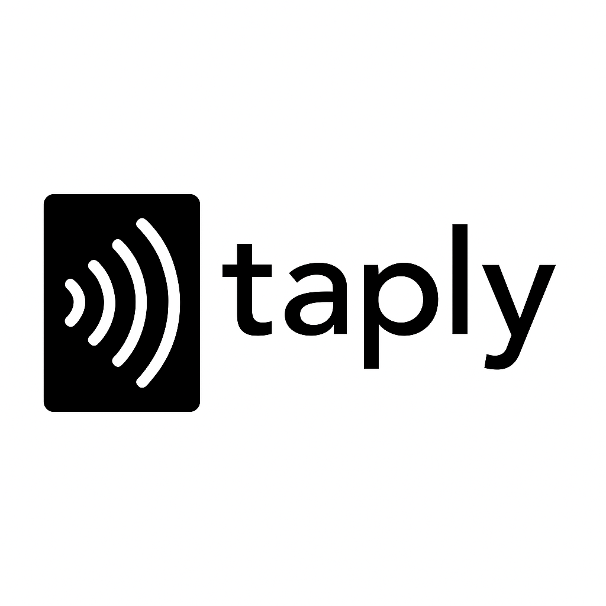

# ¿Qué es Taply?

## 🎯 Concepto

**Taply** es una tarjeta inteligente con tecnología NFC que revoluciona la forma en que los profesionales y creativos comparten su información de contacto y se conectan entre sí.

## 💡 La Idea

En un mundo cada vez más digital, el networking tradicional con tarjetas de papel se ha vuelto obsoleto. Taply combina lo mejor de ambos mundos: la tangibilidad de una tarjeta física con la potencia de la tecnología digital.

---

## 🚀 ¿Cómo Funciona?

### 1. **Un Simple Tap**
Con solo acercar tu Taply a cualquier smartphone moderno, la información se transfiere instantáneamente gracias a la tecnología NFC (Near Field Communication).

### 2. **Información Completa**
No solo nombre y teléfono. Comparte:
- 📧 Email y teléfono
- 🌐 Sitio web y portfolio
- 📱 Redes sociales (LinkedIn, Instagram, Twitter)
- 💼 Información profesional
- 📍 Ubicación y horarios
- 🎨 Contenido multimedia

### 3. **Siempre Actualizada**
¿Cambiaste de trabajo? ¿Nueva dirección? Actualiza tu perfil digital y todos los que tengan tu Taply verán la información más reciente automáticamente.

---

## 🎨 Diseño Premium

### **Estética Minimalista**
- Diseño elegante y moderno
- Materiales de alta calidad
- Acabados premium
- Grosor similar a una tarjeta de crédito

### **Personalizable**
- Diferentes colores y acabados
- Logo de tu empresa
- Información personalizada
- Diseños exclusivos

---

## 🎯 ¿Para Quién es Taply?

### **Profesionales**
- Ejecutivos y empresarios
- Consultores y freelancers
- Vendedores y representantes
- Abogados y médicos

### **Creativos**
- Diseñadores y artistas
- Fotógrafos y videógrafos
- Músicos y productores
- Influencers y content creators

### **Emprendedores**
- Startups y nuevos negocios
- Networking events
- Conferencias y ferias
- Pitch sessions

### **Estudiantes**
- Universitarios en prácticas
- Recién graduados
- Estudiantes de MBA
- Jóvenes profesionales

---

## ✨ Ventajas de Taply

### **Para Ti**
- ✅ **Impacto memorable**: Destaca en cualquier evento
- ✅ **Siempre actualizada**: No más tarjetas obsoletas
- ✅ **Ecológica**: Reduce el desperdicio de papel
- ✅ **Profesional**: Proyecta innovación y modernidad
- ✅ **Práctica**: Una sola tarjeta para toda la vida

### **Para Quien la Recibe**
- ✅ **Fácil de guardar**: Se almacena automáticamente en el teléfono
- ✅ **No se pierde**: Siempre en el contacto del móvil
- ✅ **Información completa**: Acceso a todo tu perfil profesional
- ✅ **Actualizada**: Siempre la información más reciente
- ✅ **Interactiva**: Enlaces directos a redes y portfolio

---

## 🌍 Casos de Uso Reales

### **En una Conferencia**
*"En lugar de intercambiar 20 tarjetas de papel que se perderán, con un tap de Taply, tu información queda guardada para siempre en el teléfono de tu nuevo contacto."*

### **En una Reunión de Negocios**
*"Impresiona a tus clientes potenciales mostrando que estás a la vanguardia tecnológica. Un simple tap y tienen toda tu información de contacto y portfolio."*

### **En un Evento de Networking**
*"Mientras otros buscan en sus bolsillos tarjetas arrugadas, tú simplemente acercas tu Taply. Profesional, rápido, memorable."*

### **Como Freelancer**
*"Tu portfolio, testimonios, redes sociales y contacto, todo en un tap. Perfecto para conseguir nuevos clientes."*

---

## 🔮 El Futuro del Networking

### **Más que una Tarjeta**
Taply no es solo una tarjeta de presentación digital. Es una plataforma que evoluciona:

- 📊 **Analytics**: Ve quién y cuándo accede a tu perfil
- 🔗 **Integración CRM**: Conecta con tus herramientas de trabajo
- 🎯 **Segmentación**: Diferentes perfiles para diferentes contextos
- 🤖 **IA**: Recomendaciones inteligentes de conexiones
- 🌐 **Red Global**: Conecta con otros usuarios de Taply

### **Ecosistema Completo**
- 📱 **App móvil**: Gestiona tu perfil desde cualquier lugar
- 💻 **Dashboard web**: Control total de tu presencia digital
- 📈 **Métricas**: Analiza el impacto de tu networking
- 🔔 **Notificaciones**: Sé notificado de nuevas conexiones

---

## 🎪 ¿Por Qué Ahora?

### **El Momento Perfecto**
- 📱 **Adopción NFC**: 95% de smartphones tienen NFC
- 🌱 **Conciencia ecológica**: Reducir el uso de papel
- 💼 **Trabajo remoto**: Networking digital más importante que nunca
- 🚀 **Transformación digital**: Las empresas buscan innovación

### **Tendencias del Mercado**
- El mercado de tarjetas digitales crecerá 11.2% anual hasta 2028
- 73% de profesionales prefieren métodos digitales de intercambio
- Las empresas buscan reducir su huella de carbono
- La generación Z y Millennials adoptan tecnología rápidamente

---

## 🏆 Diferenciadores de Taply

### **Vs. Tarjetas Tradicionales**
| Aspecto | Tarjeta Tradicional | Taply |
|---------|-------------------|-------|
| **Actualización** | Reimprimir siempre | Actualización instantánea |
| **Información** | Limitada | Ilimitada |
| **Interactividad** | Ninguna | Enlaces directos |
| **Sostenibilidad** | Desperdicio de papel | Ecológica |
| **Impacto** | Común | Memorable |
| **Costo** | Reimpresión constante | Una sola inversión |

### **Vs. Otras Soluciones Digitales**
- **Apps de networking**: Requieren instalación previa
- **Códigos QR**: Poco elegantes, requieren cámara
- **Bluetooth**: Lento, requiere emparejamiento
- **Taply**: Instantáneo, elegante, sin fricción

---

## 🎨 Filosofía de Marca

### **Valores Fundamentales**

**🔥 Exclusividad**
*No es para todos. Es para quienes valoran la excelencia y la innovación.*

**⚡ Tecnología**
*Adoptamos la tecnología más avanzada para crear experiencias sin fricción.*

**🎯 Simplicidad**
*La complejidad es enemiga de la adopción. Un tap, infinitas posibilidades.*

**🤝 Conexión Personal**
*Tecnología al servicio de las relaciones humanas auténticas.*

### **Posicionamiento**
*"Taply no es solo una tarjeta. Es tu identidad digital premium. Para profesionales que entienden que la primera impresión puede ser la diferencia entre una oportunidad perdida y el éxito."*

---

## 🚀 Roadmap de Producto

### **Fase 1: Lanzamiento** (Actual)
- ✅ Tarjeta NFC básica
- ✅ Perfil digital personalizable
- ✅ App móvil para gestión
- ✅ Integración con contactos

### **Fase 2: Expansión** (Q2 2025)
- 🔄 Analytics avanzados
- 🔄 Integración con CRM
- 🔄 Múltiples perfiles
- 🔄 Plantillas profesionales

### **Fase 3: Ecosistema** (Q4 2025)
- 🔮 Red social de profesionales
- 🔮 IA para recomendaciones
- 🔮 Integración con LinkedIn
- 🔮 Eventos y networking digital

### **Fase 4: Innovación** (2026+)
- 🔮 Realidad aumentada
- 🔮 Blockchain para verificación
- 🔮 IoT y smart offices
- 🔮 Expansión global

---

## 💎 Modelos y Precios

### **Taply Personal**
*Para profesionales individuales*
- Tarjeta NFC premium
- Perfil digital ilimitado
- App móvil
- Soporte básico
- **€49** (una sola vez)

### **Taply Pro**
*Para freelancers y consultores*
- Todo lo de Personal +
- Analytics detallados
- Múltiples perfiles
- Integración CRM básica
- Soporte prioritario
- **€89** (una sola vez)

### **Taply Business**
*Para equipos y empresas*
- Todo lo de Pro +
- Gestión de equipo
- Branding corporativo
- Integración CRM avanzada
- Dashboard administrativo
- **€149/usuario** (anual)

### **Taply Enterprise**
*Para grandes corporaciones*
- Solución personalizada
- Integración completa
- Soporte 24/7
- Formación incluida
- **Precio personalizado**

---

## 🌟 Testimonios

*"Taply cambió completamente mi forma de hacer networking. En la última conferencia, mientras otros buscaban bolígrafos para anotar contactos, yo simplemente hacía tap. Profesional y memorable."*
**- María González, Consultora de Marketing**

*"Como diseñador, mi portfolio es mi carta de presentación. Con Taply, un simple tap y mis clientes potenciales tienen acceso inmediato a todo mi trabajo. Game changer."*
**- Carlos Ruiz, Diseñador UX**

*"En nuestra startup, la primera impresión es crucial. Taply nos ayuda a proyectar innovación desde el primer contacto. Los inversores siempre comentan sobre nuestra tarjeta."*
**- Ana Martín, CEO TechStart**

---

## 🎯 Únete a la Revolución

**Taply no es solo una tarjeta. Es tu pasaporte al futuro del networking profesional.**

### **¿Listo para destacar?**
- 🚀 Sé de los primeros en tener Taply
- 💎 Acceso exclusivo a funciones premium
- 🎁 Precio de lanzamiento especial
- 🤝 Comunidad de early adopters

### **El futuro del networking está aquí. ¿Te unes?**

---

**Taply - La tarjeta que conecta contigo**

*Tecnología, simplicidad y exclusividad en la palma de tu mano*

---

## 📞 Contacto

**¿Tienes preguntas sobre Taply?**

- 🌐 **Web**: [taply.com](https://taply.com)
- 📧 **Email**: hola@taply.com
- 📱 **WhatsApp**: +34 600 000 000
- 💼 **LinkedIn**: /company/taply
- 📸 **Instagram**: @taply_official

---

*© 2025 Taply. Todos los derechos reservados.*
*Diseñado con ❤️ para el profesional del futuro*
